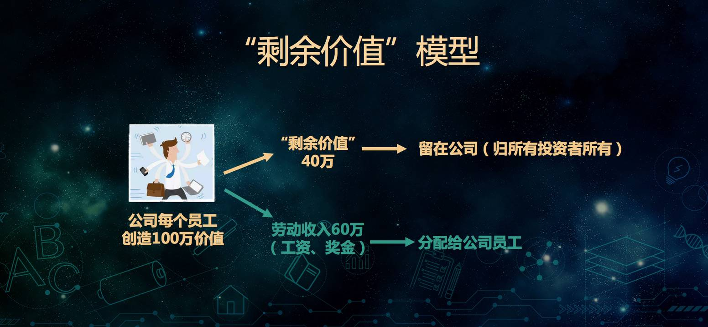
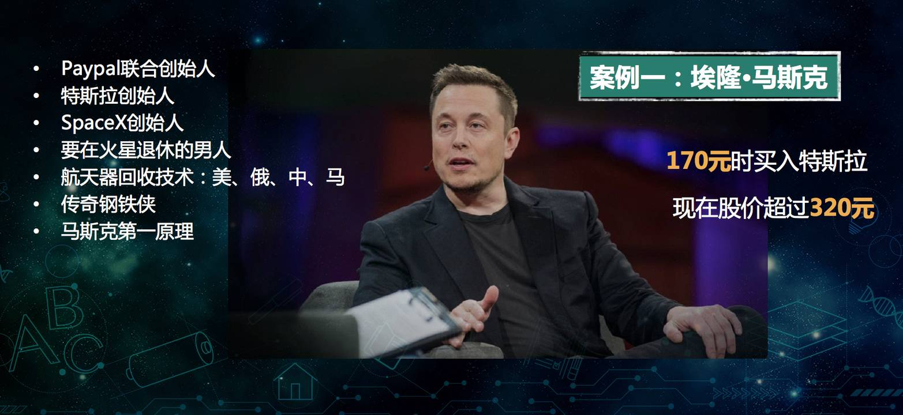

# 财商

1. 观察身边的人，找到不用靠出卖**时间**赚钱的方法
2. 投资自己，不断增值

## 赚钱惯性

### 1. 如何评估自己的投资回报比

他的钱是怎么赚的，做什么赚的，那个件事是怎么做的，风险会有多大，时间投入会有多大，精力和体力投入会有多大，投资会有多少，利润会有多少。做的好的会做成什么样，做的不好会做成什么样

任何事情，我们都要有意识的去计算下收入产出，评估自己的投资回报比。

### 2. 如何投资自己才能真正提高赚钱能力

1. 在学习**新知识**的时候，一定要有意识的去**内化为自我能力**
2. 自身有技能，需要不断去找更加**稀缺的技能**
3. 能力为本，提高**岗位内的通用技能**
4. 不断尝试、总结，发现自己更多的**兴趣和天赋**

- 查看自己微信好友数
- 梳理自己现有能力：如沟通力、表达力等
- 思考你所在行业有哪些更好的发展

## 上班族如何变身成赚钱的斜杠青年（Slash Youth: 一群不再满足“专一职业”的生活方式，而选择拥有多重职业和身份的多元生活的人群）

### 1. 称为斜杠前，必须知道的3个道理

1. 快速成功的两个要素：自己手上的活好；自己的人脉关系好
2. 你现在拥有的不可逆资产：时间、健康
3. 优化自我的可控资产：金钱、特长、品牌、情感

### 2. 这样梳理，原来你早已价值百万

1. 目标导向：长短目标
2. 目前拥有：资源盘点
3. 优势领域：超过80%~90%
4. 可观评估：如何证明
5. 称为斜杠你给自己多久的时间：兴趣爱好、本职工作、最大收益、最大损失

### 3. 怎样让现有技能最大化价值？

- 明确自己的兴趣点，并且做相关内容的学习
- 相关知识点及其他细节文字版呈现
- 以上为中心不断的优化、打磨、观察、交流
- 找到各种机会分享，不断进行迭代

### 作业

1. 你现在有什么？
2. 你有什么超过其他人80%~90%？
3. 如何证明比别人强？

## 逆袭技能

### 为什么这个能力你必须具备

- 未来最重要的资产是**影响力**，影响力由两个能力构成：**写作、演讲**
- 快速掌握这两种技能需要：高效学习力和拥有持续学习的能力

### 如何拥有持续学习的动力

- 阻碍力
  - 为什么选择学习一门课 —— 想清楚你的目的（多个）
  - 学了之后会怎么样 —— 反馈机制
  - 情绪不佳、焦虑不堪 —— 调整状态
  - 学了没出用 —— 海绵式学习
- 推动力
  - 自我目标：长中短、多维度、榜样清单、小确幸
  - 自我实现：以用为主、自我提升、物质回馈
  - 自定义人生：想要的经历、故事、画面、状态

### 如何做到高效学习

- 学习本身、记忆原理、高效低效区别
- 康纳尔笔记法
  - 1. 写要点，不要照顾老师的全部讲解
  - 2. 灵活运用缩写和符号简化笔记
- 步骤：步骤、简化、背诵、思考、复习

### 如何写出自带传播力的优质好文

- 标题：爆点人物、共鸣话题、痛点字词、颠覆认知
- 凤头：追击热点、表明观点、激发痛点、引发共鸣、关乎你我
- 猪肚：设置小标题、使用修辞手法
- 豹尾：总结全文、制造金句、熬制鸡汤

### 如何设计一个演讲

- 选择演讲的主题
- 写演讲稿：先写提纲再补充
- 改稿子
- 演练

### 逆袭技能: 作业

1. 完成自我目标设定
2. 练习写作技能
3. 练习演讲

## 月入十万的人到底在靠什么赚钱

### 想考努力、工资月入十万可能吗？

- 在这个时代你赚钱的速度是不是远远比不上货币不值钱的速度的
- 所有打工者创建的价值都远远超过其获得的收入
- 收入分配的要素按照优先级排序是：风险>资本>劳动
- 离开风险的承担，你只能过一般的生活

### 实现月入十万的渠道到底有哪些

- 进入真正的高新行业：金融(靠前赚钱)或者互联网
- 找准时代风口：自媒体、人工智能、VR、社会养老
  - 自媒体(200k-400k) + 大量粉丝(一个广告几千+每个月几个) + 今日头条 + 一点通  > 10万
  - 写稿：吸粉
  - 网红：颜值 or 才能 or 手艺
- 投资有发展潜能的创业公司 (风投机构：九鼎，立德)
- 赚取中间收益（自媒体+[中间收益]+公司）

- 写作+演讲+资源整合能力

### 你还有做哪些努力

> 除了工作本职工作，更要做好自我增值

- 写作、语言能力
- 拓展自己的人脉
- 提升资源整合能力

### 想要获得月入十万，一定要用于承担风险

- 财富的分配，不是按照学历，按照知识经验，甚至不是按照“能力”来的，而是按照**承担的风险**来的
- 跳出这片“努力”的红海，开辟一个只有一个少数人涉足的蓝海

### 月入十万的人到底在靠什么赚钱：作业

1. 思考月入十万的其他渠道
2. 你准备为月入十万付出哪些努力

## 小白借鉴：赚钱的微商是如何炼成的

### 1. 觉得微信不好的原因

- 盲目跟风
- 熟人买卖
- 发展思路不对，无休止刷频
- 初入者大量囤积
- 无固定作息时间

### 2. 觉得微商好的原因

- 新型的创业发展方式
- 门槛低，无实体设施
- 产品合格，受众面广

### 3. 赚钱的微商是什么样的

- 自我包装，陆续植入
- 代理机制
- 最大的投资是自己的个人IP
- 顺势而为，策划营销

### 4. 如何打造个人IP

- 人人都是个人品牌
- 个人品牌：**价值x人数x频次**
- 最好切入点“个人标签”：我有多好的满足谁的需求
- 传递你的价值观

### 打造个人IP实践

1. 你现在的个人品牌有哪些标签
2. 你能够为谁提供价值

## 普通人可以选择的4中赚钱方式

### 撤了劳动了以外的3个赚钱方式

- 如何最大化劳动收入
  - 把自己的时间卖出去（提高单价）
  - 把自己的一份时间多次售卖（写作，电影）

- 薅(hao1)羊毛或赚信息不对称的钱(低成本，高销售)
- 玩资本
- 简历有价值有壁垒的事情

任意一件从头开始的事情，都需要花费大量的时间去摸索经验

### 如何升级自己现有的赚钱方式

- 投入精力和热情来练习一项技能
- 学会资本思维
- 考虑时间维度

1. 你认为的劳动收入及脑力收入分别有哪些
2. 你将如何最大化的利用自己的时间

## 如何正确的开启下班后的赚钱模式

做好时间管理，赚钱有保障

1. 大任务分解成小任务
2. 用好工具：思维导图
3. 先苦后甜更容易
4. 小事不能耽误大事
5. 拒绝拖延，马上行动
6. 记录小成就
7. 没时间不是借口
9. 适当拖延
10. 学会单机立断

### 下班后的实操的4个赚钱方法

- 主业带动副业
- 分享“你可分享的”
- 理财投资
- 抓住风口行业

## 如何通过自己喜欢的事情来赚钱

- 创造性工作
- 帮助我们作为创建价值的最终目的

## 如何以最快的速度学会投资，确保赚钱

### 投资的本质是用钱来跟公司建立连接

- 公司 <--投资-- 个人
- 公司 --收益--> 个人

1. 一个公司是如何为投资者创建价值的

- 一个员工一年创造100万元价值
  - 员工工资60元
  - 剩余价值40万：归公司所有
    - 公司的投资人（归股东和债主）所有
      - 股东：公司的股票投资人
      - 债主：债券投资人

    - 剩余价值是公司给投资人创建价值
    - 剩余价值如何分配给投资者？
      - 债券投资者把钱借给公司拿利息（银行是典型的债券投资者），对剩余价值，债券投资者有优先的获得权
        - 债券投资者不是想打多少就拿多少，他们获得是利息，而利息是事先规定好的。等债券投资者拿完了，剩余的全部归股票投资者。
        - 债券投资者利息是10万元，分给股票投资者的价值是30万元。分配给股票投资者价值可以用来现金分红，也可能引起股票的价值的上涨。这两者都可以股票投资者可以赚钱。
        - 存银行的利息也来自于剩余价值，银行把你的存款借给别的公司，称为这个公司的债主，也就是债券投资人。那这些公司创造剩余价值之后，首先要还银行的利息，银行拿这些利息的一部分当成存款利息发给你。

总结：我们可以投资与公司建立链接，一旦建立了链接，我们能从公司创造的价值中获益。

我们应该跟什么样的公司建立连接？优秀的公司（先进的技术和牛人），跟优秀的公司连接，就跟这个优质的资源连接。让这些优质的资源为我打工。

2. 为投资者创造出来的价值是如何传到给投资者的

### 如何投资获得收益

1. 正确的使用投资工具
2. 不犯原则性错误

- 1. 通过投资转到的前用来经济发展；
- 2. 投资前的准备；
  - 1.预算投资金额
  - 2.掌握投资基本规律（投资期限越长，可以收益越高）
    - 投资收益最大化，根据不同的投资期限，使用不同的投资工具
  - 3. 对于无风险投资-有哪些工具和技巧
  - 4. 对于债券基金的涨跌逻辑是什么，正确的投资方法是什么
  - 5. 股票基金
    - 股票的相关知识（比如：价格是如何决定的，分红是如何赚钱的）
  - 6. 股票基金如何帮你赚钱的；如何挑选优质的基金；如何什么时候投资股票基金
  - 7. 投资股票基金的技巧；如何投资股票基金，既省心，又赚钱 => 定投
  - 8. 识别哪些股票不能投资
  - 9. 心态、知识面持续提升

